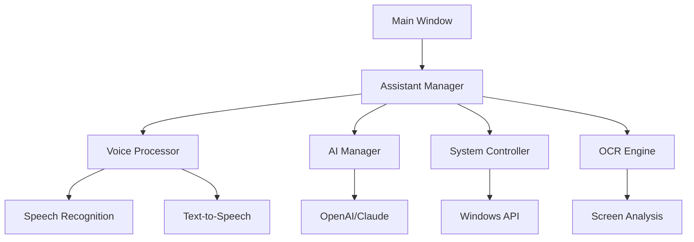

# 🤖 Computer Assistant - AI Desktop Automation

[](https://python.org)
[](LICENSE)
[](https://microsoft.com/windows)
[](https://pyside.org)
[](https://openai.com)

> **A comprehensive AI-powered desktop assistant with voice control, system automation, and advanced capabilities including OCR, financial analysis, and code generation.**

## 🌟 Features

### 🎯 Core Capabilities
- **🎤 Voice Control**: Advanced speech recognition and text-to-speech
- **🤖 AI Integration**: Support for OpenAI GPT and Anthropic Claude models
- **⚡ System Automation**: Windows application and browser control
- **👁️ OCR & Screen Analysis**: Optical character recognition and visual understanding
- **📊 System Monitoring**: Real-time performance metrics and process management
- **💰 Financial Analysis**: Stock market data and financial insights
- **💻 Code Generation**: Intelligent code assistance and automation
- **🧪 Test Automation**: Automated testing capabilities

### 🎨 User Interface
- **Modern GUI**: Built with PySide6 for responsive design
- **🌓 Theme Support**: Light and dark themes with accessibility compliance
- **📱 Tabbed Interface**: Organized workspace with multiple specialized tabs
- **🔧 Settings Management**: Comprehensive configuration options
- **📝 Real-time Logging**: Live log monitoring and debugging

### 🔧 Advanced Features
- **🧠 Machine Learning**: Adaptive learning and performance optimization
- **🌐 Web Automation**: Selenium-based browser control
- **📸 Screen Capture**: Advanced screenshot and screen analysis
- **🎯 Window Management**: Intelligent window control and organization
- **📈 Performance Analytics**: Detailed metrics and optimization insights

## 🚀 Quick Start

### Prerequisites
- **Python 3.8+** (Recommended: Python 3.10+)
- **Windows 10/11** (Primary platform)
- **4GB RAM** minimum (8GB+ recommended)
- **Audio devices** for voice features

### Installation

1. **Clone the repository**
   ```bash
   git clone https://github.com/yourusername/computer-assistant.git
   cd computer-assistant
   ```

2. **Create virtual environment**
   ```bash
   python -m venv venv
   venv\Scripts\activate  # Windows
   ```

3. **Install dependencies**
   ```bash
   pip install -r requirements.txt
   ```

4. **Configure API keys** (Optional)
   ```bash
   # Create .env file with your API keys
   OPENAI_API_KEY=your_openai_key_here
   ANTHROPIC_API_KEY=your_anthropic_key_here
   ```

5. **Run the application**
   ```bash
   python main.py
   ```

## 📖 Usage Guide

### 🎤 Voice Commands
```
"Open calculator"           # Launch applications
"Take a screenshot"         # Screen capture
"What's on my screen?"      # OCR analysis
"Check system performance"  # System monitoring
"Switch to dark theme"      # Theme control
```

### 🖥️ GUI Navigation
- **Dashboard**: System overview and quick actions
- **Automation**: Task management and system control
- **Voice Control**: Speech settings and voice commands
- **AI Chat**: Conversation interface with AI models
- **Window Manager**: Window control and organization
- **System Monitor**: Performance metrics and processes
- **OCR**: Text extraction and screen analysis
- **Settings**: Configuration and preferences

### 🔧 Configuration
The application uses a comprehensive configuration system:
- **Voice settings**: STT/TTS engines, thresholds
- **AI integration**: Model selection, API configuration
- **System automation**: Execution speed, safety settings
- **GUI preferences**: Themes, layouts, notifications

## 🏗️ Architecture

### 📁 Project Structure
```
computer-assistant/
├── src/
│   ├── core/              # Core management (config, assistant)
│   ├── gui/               # User interface components
│   │   ├── widgets/       # Specialized UI widgets
│   │   ├── main_window.py # Main application window
│   │   └── theme_manager.py # Theme and styling
│   ├── ai/                # AI integration and management
│   ├── audio/             # Voice processing (STT/TTS)
│   ├── automation/        # System and browser automation
│   ├── ocr/               # Optical character recognition
│   ├── nlp/               # Natural language processing
│   ├── ml/                # Machine learning components
│   ├── specialized/       # Domain-specific modules
│   └── utils/             # Utilities and helpers
├── main.py                # Application entry point
├── requirements.txt       # Python dependencies
└── README.md             # This file
```

### 🔄 Component Flow


## 🛠️ Development

### 🔧 Setup Development Environment
```bash
# Install development dependencies
pip install -r requirements-dev.txt

# Run tests
python -m pytest tests/

# Code formatting
black src/
flake8 src/

# Type checking
mypy src/
```

### 🧪 Testing
```bash
# Run GUI tests
python test_gui.py

# Run specific component tests
python -m pytest tests/test_voice.py
python -m pytest tests/test_automation.py
```

### 📊 Performance Monitoring
The application includes built-in performance monitoring:
- Response time tracking
- Memory usage optimization
- CPU utilization monitoring
- Task execution analytics

## 🤝 Contributing

We welcome contributions! Please see our [Contributing Guidelines](CONTRIBUTING.md) for details.

### 🐛 Bug Reports
- Use the [issue tracker](https://github.com/yourusername/computer-assistant/issues)
- Include system information and logs
- Provide steps to reproduce

### 💡 Feature Requests
- Check existing issues first
- Describe the use case clearly
- Consider implementation complexity

## 📋 Requirements

### 🐍 Python Dependencies
- **Core**: `numpy`, `scipy`, `scikit-learn`
- **AI/ML**: `tensorflow`, `torch`, `transformers`
- **Audio**: `pyaudio`, `pydub`, `librosa`
- **Vision**: `opencv-python`, `Pillow`, `pytesseract`
- **GUI**: `PySide6`, `customtkinter`
- **System**: `pywin32`, `psutil`, `pyautogui`
- **Web**: `selenium`, `requests`, `beautifulsoup4`

### 🖥️ System Requirements
- **OS**: Windows 10/11 (64-bit)
- **RAM**: 4GB minimum, 8GB+ recommended
- **Storage**: 2GB free space
- **Network**: Internet connection for AI features

## 🔒 Security & Privacy

- **Local Processing**: Core functionality works offline
- **API Security**: Encrypted API key storage
- **Data Privacy**: No personal data collection
- **Safe Automation**: Built-in safety checks and limits

## 📄 License

This project is licensed under the MIT License - see the [LICENSE](LICENSE) file for details.

## 🙏 Acknowledgments

- **OpenAI** for GPT models and API
- **Anthropic** for Claude AI integration
- **Qt/PySide** for the excellent GUI framework
- **Python Community** for amazing libraries
- **Contributors** who make this project better

## 📞 Support

- **Documentation**: [Wiki](https://github.com/yourusername/computer-assistant/wiki)
- **Issues**: [GitHub Issues](https://github.com/yourusername/computer-assistant/issues)
- **Discussions**: [GitHub Discussions](https://github.com/yourusername/computer-assistant/discussions)
- **Email**: support@computer-assistant.com

---

<div align="center">

**⭐ Star this repository if you find it helpful!**

Made with ❤️ by the Computer Assistant Team

</div># assistant

